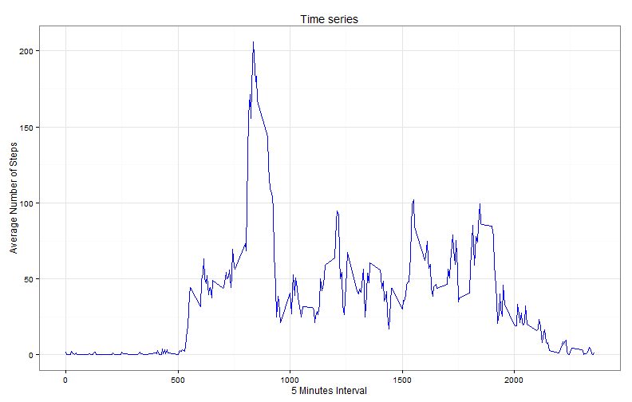
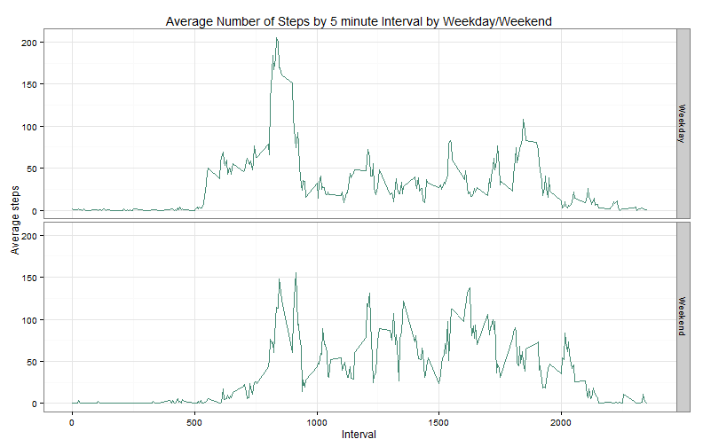

## Introduction
It is now possible to collect a large amount of data about personal
movement using activity monitoring devices.

This assignment makes use of data from a personal activity monitoring
device. This device collects data at 5 minute intervals through out the
day. The data consists of two months of data from an anonymous
individual collected during the months of October and November, 2012
and include the number of steps taken in 5 minute intervals each day.

## Data

The data for this assignment can be downloaded from the course web
site:

* Dataset: [Activity monitoring data](https://d396qusza40orc.cloudfront.net/repdata%2Fdata%2Factivity.zip) [52K]

The variables included in this dataset are:

* **steps**: Number of steps taking in a 5-minute interval (missing
    values are coded as `NA`)

* **date**: The date on which the measurement was taken in YYYY-MM-DD
    format

* **interval**: Identifier for the 5-minute interval in which
    measurement was taken


The dataset is stored in a comma-separated-value (CSV) file and there
are a total of 17,568 observations in this
dataset.

## Loading and preprocessing the data

In order to show the code used to generate the output we make the following 
global settings:


```r
library(knitr)
opts_chunk$set(echo = TRUE, fig.width=11, fig.path="figures/")
```

Setting the locale to C, that being useful to read the weekdays in English. 
Additionally, we ensure a clean environment. 


```r
rm(list=ls())
Sys.setlocale("LC_ALL", "C")
```

```
## [1] "C"
```

Load the data and convert 'date' variable from character to date.


```r
## unzip and load data
## unzip(zipfile="activity.zip", files="activity.csv")
activity<-read.csv("activity.csv", stringsAsFactors=FALSE)
## transform date
activity$date<-as.Date(activity$date,"%Y-%m-%d")
## Check data
summary(activity)
```

```
##      steps             date               interval     
##  Min.   :  0.00   Min.   :2012-10-01   Min.   :   0.0  
##  1st Qu.:  0.00   1st Qu.:2012-10-16   1st Qu.: 588.8  
##  Median :  0.00   Median :2012-10-31   Median :1177.5  
##  Mean   : 37.38   Mean   :2012-10-31   Mean   :1177.5  
##  3rd Qu.: 12.00   3rd Qu.:2012-11-15   3rd Qu.:1766.2  
##  Max.   :806.00   Max.   :2012-11-30   Max.   :2355.0  
##  NA's   :2304
```

There are 2304 missing values in steps variable.

## What is mean total number of steps taken per day?

Total number of steps per day, ignoring the missing values


```r
## sum per day, ignor missing values
steps_day = aggregate(steps ~ date, data=activity, FUN=sum, na.rm=T)
```

Calculate and report the mean and median of total steps taken per day


```r
## Calculate the mean and median
steps_mean<-mean(steps_day$steps, na.rm=T)
steps_median<-median(steps_day$steps, na.rm=T)
```

The mean number of steps per day is **r steps_mean**.
The medium number of steps per day is **r steps_median**.

Histogram of the total numeber of steps per day is presented below:


```r
library(ggplot2)
g5<-ggplot(steps_day, aes(steps_day$steps))+
        geom_histogram (binwidth=5000, fill="blue", colour="black")+
        ggtitle("Histogram of total number of steps per day")+
        labs(x = "Steps", y = "Frequency")+
        scale_y_continuous(limits=c(0,30))+
        scale_x_continuous(limits=c(0,25000))+
        theme_bw(base_family = "Avenir", base_size = 12)
g5
```

 

## What is the average daily activity pattern?
Average number of steps across all days:


```r
## average per day
steps_interval = aggregate(steps ~ interval, data=activity, FUN=mean)
```


```r
## interval which contains the maximum number of steps
maxsteps<-steps_interval[which.max(steps_interval$steps), "interval"]
```
The 5-minute interval, on average across all the days in the dataset, contains the maximum number of steps is  **r maxsteps**.

The maximum number of steps is the peak of the following time series plot:


```r
library(ggplot2)
g6 <- ggplot(steps_interval, aes(x=interval, y=steps)) +
        geom_line(color="blue") +
        labs(x="5 Minutes Interval", y="Average Number of Steps") +
        ggtitle("Time series")+
        theme_bw(base_family = "Avenir", base_size = 12)
g6
```

 

## Imputing missing values
Note that there are a number of days/intervals where there are missing
values (coded as `NA`). The presence of missing days may introduce
bias into some calculations or summaries of the data.

Find the number of incomplete cases


```r
number_miss<-sum(is.na(activity$steps))
number_miss
```

```
## [1] 2304
```

Number of rows with missing values is  **r number_miss**.

We fill in the missing values of steps variable with the median values for that 
interval. We create a new data whitout missing values and we calculate the new mean and median of total steps per day.


```r
## data with mean by interval, when without missing 

library(dplyr)
median_interval<- activity  %>%
        select(interval,steps)%>%
        group_by(interval)%>%
        summarise(med = as.integer(median(steps, na.rm = TRUE)))

## merge 2 data by interval
new_activity<-merge(activity,median_interval, by="interval")
## use mean to complete NA in steps
new_activity<-new_activity %>%
        mutate(steps = ifelse(is.na(steps), med, steps)) %>%
        select(date, interval, steps)
```

Total number of steps per day, after filling the missing values


```r
## sum per day, ignorr missing values
steps_day_fill = aggregate(steps ~ date, data=new_activity, FUN=sum, na.rm=T)
```

Calculate and report the mean and median of total steps taken per day


```r
## Calculate the mean and median
steps_mean_fill<-mean(steps_day_fill$steps)
steps_median_fill<-median(steps_day_fill$steps)
```

The mean number of steps per day is **r steps_mean_fill**.
The medium number of steps per day is **r steps_median_fill**.

Histogram of the total numeber of steps per day is presented below:


```r
library(ggplot2)
g7<-ggplot(steps_day_fill, aes(steps_day_fill$steps))+
        geom_histogram (binwidth=5000, fill="blue", colour="black")+
        ggtitle("Histogram of total imputed number of steps per day")+
        labs(x = "Steps", y = "Frequency")+
        scale_y_continuous(limits=c(0,30))+
        scale_x_continuous(limits=c(0,25000))+
        theme_bw(base_family = "Avenir", base_size = 12)
g7
```

 

From the above we notice a slightly change in mean value from **r steps_mean** to **r steps_mean_fill**.There is not a significant change of meadian value from
**r steps_mean** to **r steps_mean_fill**. 

Comparing the two histograms, before and after imputing the missing values
with the calculated median, we observe that the frequency of less steps increased.


## Are there differences in activity patterns between weekdays and weekends?

In the dataset with the filled-in missing values we create a factor variable with two levels -- "weekday" and "weekend" indicating whether a given date is a weekday or weekend day. We calculate the averaged number of steps taken across weekday days or weekend days. 


```r
## create a new factor variable weekday, weekend
## calculate average by this new factor
library(dplyr)
activityweek <- new_activity %>%
    mutate(weekday = factor(ifelse(weekdays(date)%in% c("Saturday", "Sunday"), "Weekend", "Weekday"))) %>%
    select(weekday, interval, steps) %>%
    group_by(weekday, interval) %>%
    summarise(average = mean(steps))
```

The panel plot containing time series plot of interval and averaged number of steps across weekends versus weekdays. In weekend, it can be observe more activity.


```r
library(ggplot2)
g8<-ggplot(activityweek, aes(activityweek$interval,activityweek$average))+
   geom_line(color="aquamarine4")+
   facet_grid(weekday ~ .) +
   theme_bw(base_family = "Avenir", base_size = 12)+
   labs(x = "Interval", y = "Average steps")+
   ggtitle('Average Number of Steps by 5 minute Interval by Weekday/Weekend')     
   g8
```

 


   
